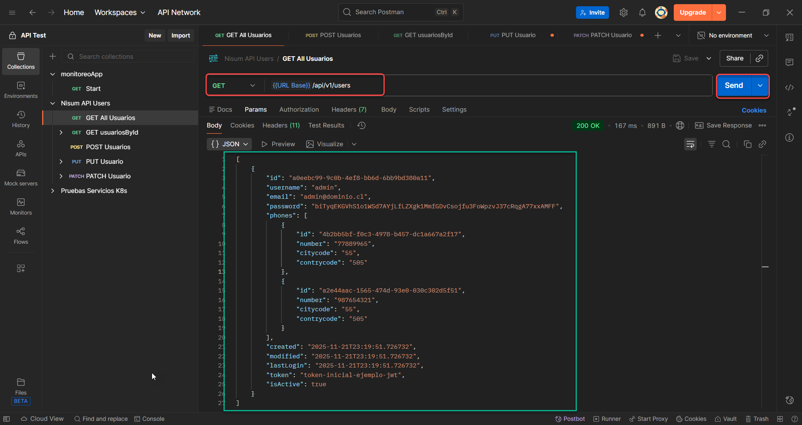
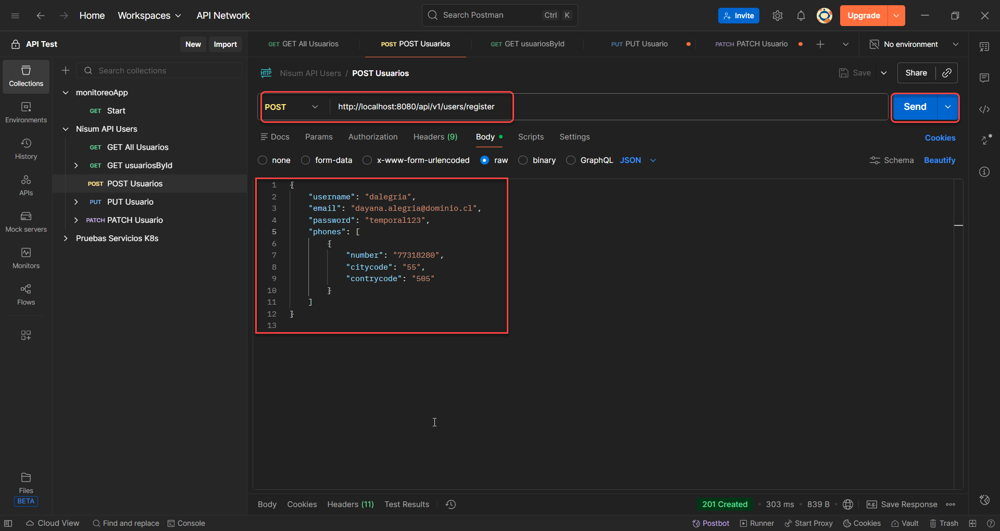
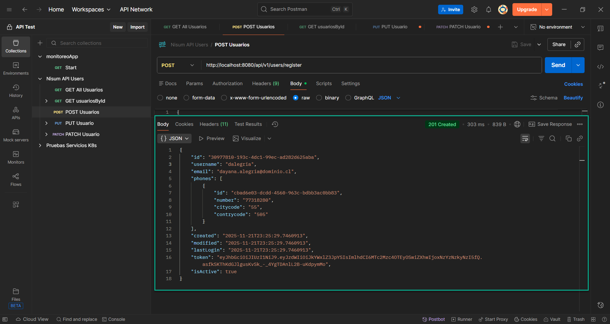
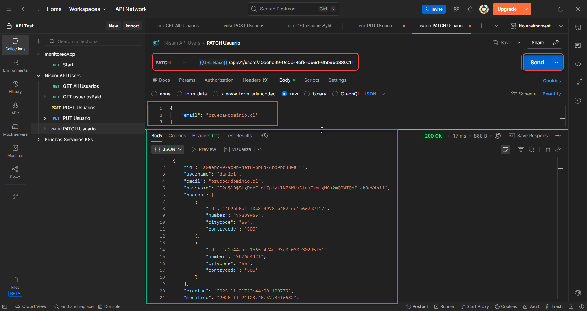
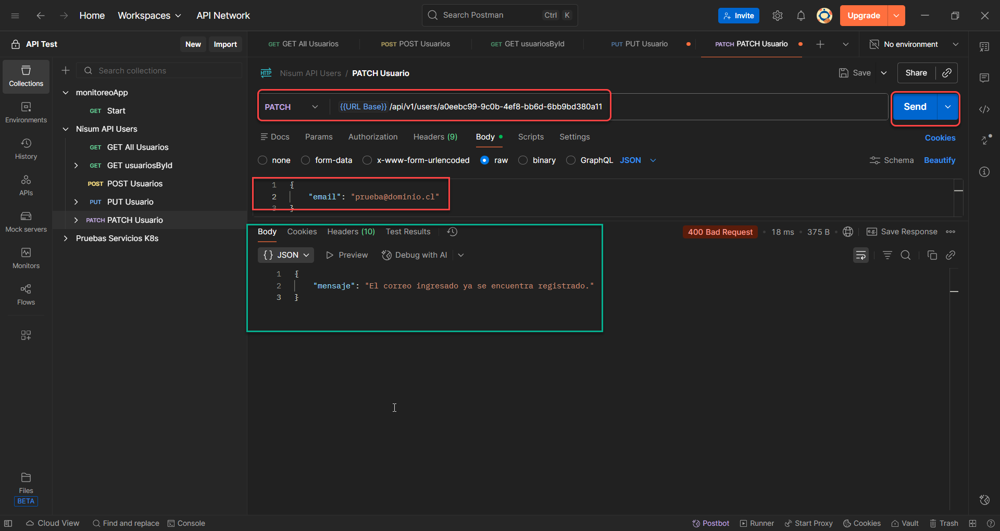

# **🚀 Microservicio de Gestión de Usuarios (ms\_usuario)**
Este proyecto es una API RESTful desarrollada en Spring Boot para la gestión completa de usuarios (CRUD). Su objetivo principal es ofrecer un servicio robusto, seguro y bien documentado, con un enfoque especial en la validación de datos críticos (correo y contraseña) y la autenticación mediante JWT.

***Especificaciones:***

Implementation de Request: **GET, POST, PUT, PATCH Y DELETE.**
### ***Características Principales***
- **Seguridad:** Generación de JWT para la autenticación post-registro.
- **Validaciones:** Validación estricta de formato de correo, unicidad de usuario y reglas de fortaleza de contraseña.
- **Operaciones:** Implementación completa de GET, POST, PUT, PATCH y DELETE.

**Documentación:** Integración con Swagger/OpenAPI para la documentación interactiva de la API.

**🛠️ Especificaciones y Tecnologías**

|**Componente**|**Descripción**|**Enlace**|
| :-: | :-: | :-: |
|**Framework**|**Spring Boot (Java)**|[**https://start.spring.io** ](https://start.spring.io/)|
|**API RESTful**|**Implementación de todos los verbos HTTP.**|**N/A**|
|**Seguridad**|**Generación de JWT (JSON Web Token) en el registro.**|[**jwt.io**](https://www.jwt.io/)|
|**Documentación**|**Uso de Swagger/OpenAPI 3.**|[**http://localhost:8080/swagger-ui/index.html#/**](http://localhost:8080/swagger-ui/index.html#/)** |
|**Pruebas**|**Pruebas de consumo realizadas con Postman.**|[**postman.com**](https://www.postman.com/)|
|**Repositorio**|**Control de versiones con GitHub.**|[**https://github.com/danielquincy/ms_usuario** ](https://github.com/danielquincy/ms_usuario)|
|**Diagramación**|**Diagramas de flujo y arquitectura creados con Draw.io.**|[**app.diagrams.net**](https://app.diagrams.net/)|

## ***📁 Estructura del Proyecto***
El proyecto sigue el patrón de diseño MVC (Modelo-Vista-Controlador) y está organizado por capas:

com.microservicio\
` `├── config/             # Configuración de JWT, Seguridad, Email y Swagger\
` `├── controller/         # Capa de API, maneja las solicitudes HTTP (UserController)\
` `├── exception/          # Excepciones personalizadas (EmailException, UserExistsException)\
` `├── model/              # Entidades de datos y DTOs (Usuario, Telefono, RegistroRequest)\
` `├── repository/         # Capa de Persistencia (UsuarioDao, TelefonoDao)\
` `├── service/            # Capa de Lógica de Negocio (UsuarioServiceImpl)\
` `└── utils/              # Herramientas (JwtUtil, UsuarioMapper)

## ***💻 Instalación y Ejecución***
Sigue estos pasos para clonar y ejecutar el proyecto localmente:

1. **Clonar el Repositorio:**\
   git clone <https://github.com/danielquincy/ms_usuario.git>

   cd ms\_usuario

1. **Compilar y construir el proyecto (usando Maven):**\
   mvn clean\
   mvn install
1. **Ejecutar la Aplicación:**\
   Inicia la aplicación Spring Boot. Por defecto, se ejecutará en el puerto 8080.

## ***🌐 Endpoints y Flujo de Interacción Detallado***
El microservicio expone todos los endpoints bajo la ruta base /api/v1/users.

## ***Ejemplo de ejecución de los Endpoints.***

**GET (Todos los Usuarios):** [*http://localhost:8080/api/v1/users*](http://localhost:8080/api/v1/users)

*Devolverá el registro que viene como inserción en el archivo **data.sql***

 

 
**POST ():** <http://localhost:8080/api/v1/users/register>

Registrará los datos del usuario en formato JSON

**Ejemplo:**

**Resultado:**

 
**GET (Obtener un Usuario por su Id):**

[*http://localhost:8080/api/v1/users*](http://localhost:8080/api/v1/users)/* a0eebc99-9c0b-4ef8-bb6d-6bb9bd380a11

**Resultado:**

 

**PUT (Hacer cambios en todo el registro):**

[*http://localhost:8080/api/v1/users*](http://localhost:8080/api/v1/users)/* a0eebc99-9c0b-4ef8-bb6d-6bb9bd380a11

**Ejemplo:**

Resultado:\

 
**PATCH (Hacer cambios parciales al objeto):**

[*http://localhost:8080/api/v1/users*](http://localhost:8080/api/v1/users)/* a0eebc99-9c0b-4ef8-bb6d-6bb9bd380a11

**Ejemplo y Resultado:**

Luego probamos y vemos una de sus validaciones:

## ` `***Diseño Secuencial de Interacción.***

